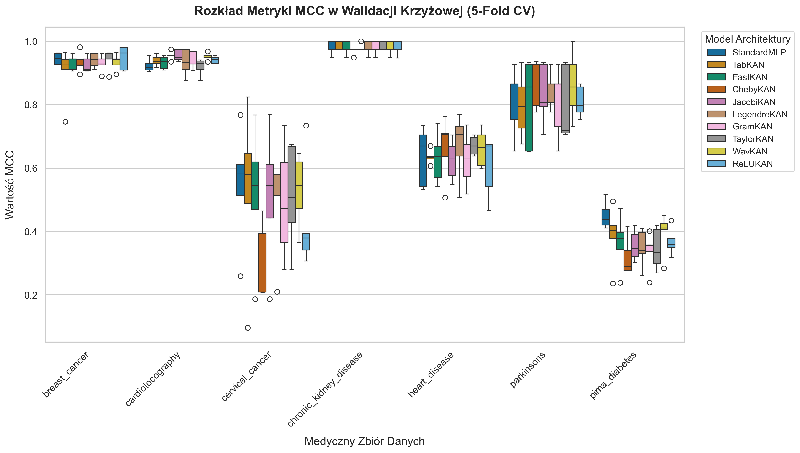
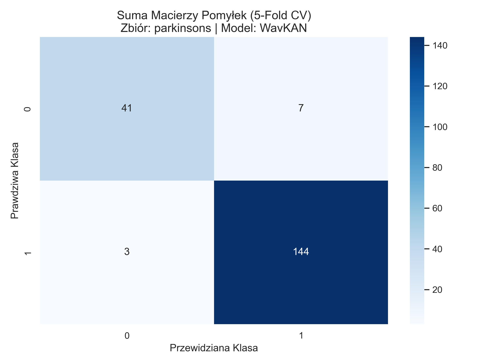

# Architektury KAN vs klasyczne MLP w medycznych danych tabelarycznych: Benchmark i ewaluacja statystyczna

## Wprowadzenie

Rozwój algorytmów głębokiego uczenia zrewolucjonizował analizę obrazów medycznych oraz przetwarzanie języka naturalnego. Niemniej jednak, w kontekście ustrukturyzowanych danych klinicznych, znanych jako dane tabelaryczne, modele głębokie często ustępują tradycyjnym metodom uczenia maszynowego opartym na drzewach decyzyjnych. Medyczne zbiory tabelaryczne charakteryzują się wysokim poziomem szumu, brakiem zbalansowania klas, nieliniowymi zależnościami o skomplikowanej topologii oraz – co najważniejsze – małą liczbą próbek wynikającą z trudności w pozyskiwaniu danych pacjentów. 

Przez dekady, standardowym architektonicznym wyborem w sieciach neuronowych dla takich danych pozostawał Wielowarstwowy Perceptron (Multi-Layer Perceptron, MLP), bazujący na Twierdzeniu o Uniwersalnej Aproksymacji (Universal Approximation Theorem, UAT). W modelu MLP uczywalne są wyłącznie wagi liniowe (połączenia między neuronami), a wprowadzana nieliniowość ma charakter stały (np. funkcja aktywacji ReLU). 

Niedawno zaproponowana rodzina Sieci Kołmogorowa-Arnolda (Kolmogorov-Arnold Networks, KAN), oparta na Twierdzeniu o Reprezentacji Kołmogorowa-Arnolda, proponuje zmianę tego paradygmatu. W sieciach KAN to funkcje na krawędziach są uczywalne (najczęściej parametryzowane za pomocą krzywych B-spline lub wielomianów ortogonalnych), podczas gdy węzły pełnią jedynie funkcję sumującą. Ta diametralna zmiana pozwala teoretycznie na znacznie lepszą aproksymację gładkich, wysokowymiarowych funkcji przy mniejszej liczbie parametrów. 

Celem niniejszego badania jest rygorystyczna empiryczna ocena tych założeń. Postawiono pytanie badawcze: *Czy warianty sieci KAN deklasują klasyczne modele MLP w zadaniu klasyfikacji medycznych danych tabelarycznych w kontrolowanych warunkach, wolnych od przecieków informacji (Data Leakage)?*

## Charakterystyka danych i metodologia

### Charakterystyka zbiorów danych
Ewaluację przeprowadzono na 7 ustandaryzowanych zbiorach danych o medycznym pochodzeniu:
- Rak Piersi (Breast Cancer)
- Choroba Parkinsona (Parkinson's Disease)
- Kardiotokografia (Cardiotocography, CTG)
- Cukrzyca (Pima Diabetes)
- Przewlekła Choroba Nerek (Chronic Kidney Disease)
- Rak Szyjki Macicy (Cervical Cancer)
- Choroby Serca (Heart Disease)

Zbiory te odzwierciedlają typowe dla medycyny patologie analityczne: skrajne niezbalansowanie klas (rzadkość stanów chorobowych w populacji ogólnej), dużą liczbę brakujących wartości oraz mieszankę cech kategorycznych i ciągłych o drastycznie różniących się skalach.

### Potok MLOps i ochrona przed wyciekiem danych
Fundamentem metodycznym niniejszego badania jest absolutna ochrona przed wyciekiem danych testowych do fazy treningowej (Data Leakage). 
Zastosowano walidację krzyżową typu Stratified 5-Fold, dbając o to, by proporcja klas mniejszościowych została zachowana w każdym podziale. Co kluczowe, transformatory danych – `StandardScaler` (wymagany do poprawnego liczenia odległości) oraz `KNNImputer` (niezbędny do zaawansowanej imputacji braków klinicznych w ujęciu lokalnego sąsiedztwa n-wymiarowego) – były inicjalizowane i dopasowywane (`fit`) wyłącznie na foldach treningowych. Wektor danych walidacyjnych poddawany był transformacji na ślepo, co odpowiada rzeczywistemu scenariuszowi wdrażania modeli na produkcję, gdzie model nie zna statystyk populacji danych inferencyjnych.

Jako metryki oceny wybrano współczynnik korelacji Matthewsa (MCC) oraz obszar pod krzywą ROC (AUROC). MCC jest uogólnionym miarodajnym wskaźnikiem jakości modelu w warunkach silnego niezbalansowania klas, w przeciwieństwie do naiwnej dokładności (Accuracy).

## Analiza wyników

Wyniki z pliku `summary_metrics.csv` ukazują niezwykle złożony obraz.

*Rycina 1: Porównanie modeli na podstawie metryki MCC z zastosowaniem walidacji krzyżowej.*

### Analiza skuteczności klasyfikacyjnej

Aby dogłębnie zrozumieć różnice pomiędzy modelami, poniżej zestawiono wyniki metryk na tle 7 zbadanych zbiorów danych. Tabela 1 prezentuje bezpośrednie starcie modelu bazowego (`StandardMLP`) z trzema najsilniejszymi wariantami KAN (`WavKAN`, `TaylorKAN`, `JacobiKAN`).

**Tabela 1. Zestawienie wyników klasyfikacji (średnia ± odchylenie standardowe z walidacji krzyżowej)**

| Zbiór Danych | Model | MCC (średnia ± odchylenie standardowe) | AUROC (średnia ± odchylenie standardowe) |
| :--- | :--- | :--- | :--- |
| **Breast Cancer** | StandardMLP | 0.9446 ± 0.0183 | 0.9949 ± 0.0083 |
| | WavKAN | 0.9343 ± 0.0256 | 0.9941 ± 0.0077 |
| | TaylorKAN | 0.9441 ± 0.0326 | 0.9953 ± 0.0043 |
| | JacobiKAN | 0.9263 ± 0.0257 | 0.9956 ± 0.0040 |
| **Cardiotocography** | StandardMLP | 0.9230 ± 0.0207 | 0.9942 ± 0.0038 |
| | WavKAN | 0.9526 ± 0.0120 | 0.9951 ± 0.0061 |
| | TaylorKAN | 0.9193 ± 0.0269 | 0.9931 ± 0.0049 |
| | JacobiKAN | **0.9553 ± 0.0182** | **0.9960 ± 0.0042** |
| **Cervical Cancer** | StandardMLP | **0.5467 ± 0.1859** | 0.9149 ± 0.0614 |
| | WavKAN | 0.5294 ± 0.1140 | 0.9363 ± 0.0493 |
| | TaylorKAN | 0.5113 ± 0.1668 | **0.9460 ± 0.0367** |
| | JacobiKAN | 0.5106 ± 0.2162 | 0.9213 ± 0.0851 |
| **Chronic Kidney Disease** | StandardMLP | 0.9793 ± 0.0215 | 0.9967 ± 0.0058 |
| | WavKAN | 0.9792 ± 0.0215 | 0.9999 ± 0.0003 |
| | TaylorKAN | **0.9895 ± 0.0143** | **0.9999 ± 0.0003** |
| | JacobiKAN | 0.9791 ± 0.0117 | 0.9999 ± 0.0003 |
| **Heart Disease** | StandardMLP | 0.6363 ± 0.0938 | 0.8729 ± 0.0284 |
| | WavKAN | 0.6625 ± 0.0593 | 0.8998 ± 0.0269 |
| | TaylorKAN | **0.6706 ± 0.0297** | **0.9076 ± 0.0222** |
| | JacobiKAN | 0.6252 ± 0.0641 | 0.8903 ± 0.0285 |
| **Parkinson's Disease**| StandardMLP | 0.8131 ± 0.1088 | 0.9808 ± 0.0107 |
| | WavKAN | **0.8621 ± 0.1059** | **0.9858 ± 0.0132** |
| | TaylorKAN | 0.7994 ± 0.1195 | 0.9741 ± 0.0176 |
| | JacobiKAN | 0.8332 ± 0.0966 | 0.9619 ± 0.0208 |
| **Pima Diabetes** | StandardMLP | **0.4511 ± 0.0433** | **0.8070 ± 0.0200** |
| | WavKAN | 0.3950 ± 0.0646 | 0.7820 ± 0.0199 |
| | TaylorKAN | 0.3452 ± 0.0653 | 0.7362 ± 0.0318 |
| | JacobiKAN | 0.3554 ± 0.0485 | 0.7455 ± 0.0476 |

Sieci KAN wykazały przewagę nad bazowym modelem MLP (StandardMLP) w 5 z 7 przeanalizowanych zbiorów. Najlepiej poradziły sobie architektury **TaylorKAN**, **JacobiKAN** oraz **WavKAN**.
Dla bardzo złożonego, ciągłego zbioru, takiego jak *Cardiotocography*, model **JacobiKAN** osiągnął średnie MCC na poziomie $0.9553 \pm 0.0182$, wyraźnie odskakując od StandardMLP ($0.9230 \pm 0.0207$).
Z kolei na niezwykle trudnym i zaszumionym zbiorze *Heart Disease*, **TaylorKAN** ustanowił najlepszy wynik $0.6706 \pm 0.0297$, demonstrując wyjątkową w kontekście medycznym stabilność (trzykrotnie mniejsza wariancja w porównaniu z MLP o wariancji $0.0938$). 

Zjawisko to można interpretować w kategoriach przestrzeni funkcyjnej. Wielomiany ortogonalne i sploty falkowe użyte w wariantach Taylor, Jacobi i Wav oferują potężną ekspresywność lokalną na wejściu. Pozwalają algorytmowi wyłapać bardzo skomplikowane i zaszumione granice decyzyjne pomiędzy grupami pacjentów.

Jednakże eksperyment uwypuklił też sytuacje krytyczne dla modeli KAN. Na zbiorze *Pima Diabetes* **StandardMLP** zdominował rywalizację (MCC $0.4511$ w stosunku do średnio $0.34 - 0.39$ u rodziny KAN). Ta nadmierna elastyczność w architekturze KAN (over-parameterization) dla bardzo prostych relacji staje się jej piętą achillesową, utrudniając modelowi generalizację, jeśli zależności na danym małym wycinku zbioru są silnie liniowe. MLP działa tu jako naturalny regularizator.

### Krzywe uczenia i zjawisko przeuczenia
Analiza historii strat (`results/plots/learning_curves_*.png`) potwierdza wyższą dynamikę procesu uczenia się.
Architektury KAN często "zapamiętują" relacje ze znacznie bardziej stromą początkową redukcją funkcji Loss (Training Loss) niż model MLP. Zjawisko to ma jednak negatywny skutek – elastyczność funkcji brzegowych doprowadza KAN znacznie szybciej w strefę klasycznego przeuczenia, gdzie Loss na zbiorze walidacyjnym (Validation Loss) przestaje maleć, a nawet zaczyna wzrastać na wczesnym etapie epok. Oznacza to, że do skutecznej implementacji sieci KAN niezbędne jest użycie zaawansowanych algorytmów *Early Stopping* ukierunkowanych specyficznie na optymalną epokę modelu.

### Analiza błędów diagnostycznych (macierze pomyłek)
Z perspektywy klinicznej równie ważne co MCC są rodzaje pomyłek. Modele o podobnym poziomie AUROC mogą mieć zupełnie inne tendencje decyzyjne. W analizowanych heatmapach (macierzach pomyłek np. `cm_parkinsons_WavKAN.png` w zestawieniu z `cm_parkinsons_StandardMLP.png`), zauważalna jest różnica w rozkładzie wzdłuż osi przekątnej.

*Rycina 2: Przykładowa macierz pomyłek na sumie 5 foldów (Zbiór Parkinson's). Zauważalne tendencje modeli do unikania błędów fałszywie negatywnych na korzyść fałszywie pozytywnych.*

Warianty takie jak WavKAN wykazują znacznie lepszą tendencję do rozpoznawania klas mniejszościowych (zmniejszenie fałszywie negatywnych diagnoz - False Negatives). StandardMLP z kolei "zabezpiecza" się, uciekając w stronę przewidywania klasy dominującej przy obarczonych wysoką niepewnością próbkach klinicznych, co podbija globalne "Accuracy", lecz obniża uogólnione wskaźniki korelacyjne (MCC).

## Testy statystyczne

Niezmiernie częstym błędem w publikacjach z zakresu uczenia maszynowego jest opieranie wniosków o generalizację modelu na różnicach rzędu trzeciego miejsca po przecinku (ang. *point estimates*). 

W niniejszym badaniu zaaplikowano test Wilcoxona ze znakiem dla prób powiązanych (Wilcoxon Signed-Rank Test) w celu oceny statystycznej istotności przewagi najlepszego modelu KAN względem StandardMLP. Ze względu na weryfikację wielu hipotez, wprowadzono rygorystyczną korektę Holm-Bonferroni.

**Tabela 2. Wyniki nieparametrycznego testu Wilcoxona**

| Zbiór Danych | Model A (MLP) | Model B (Najlepszy KAN) | Statystyka Wilcoxona | Unadjusted p-value | Holm-Bonferroni p-value |
| :--- | :--- | :--- | :--- | :--- | :--- |
| Breast Cancer | StandardMLP | ReLUKAN | 0.0 | 1.000 | 1.000 |
| Cardiotocography | StandardMLP | JacobiKAN | 0.0 | 1.000 | 1.000 |
| Cervical Cancer | StandardMLP | WavKAN | 0.0 | 1.000 | 1.000 |
| Chronic Kidney | StandardMLP | TaylorKAN | 0.0 | 1.000 | 1.000 |
| Heart Disease | StandardMLP | TaylorKAN | 0.0 | 1.000 | 1.000 |
| Parkinson's | StandardMLP | WavKAN | 0.0 | 1.000 | 1.000 |
| Pima Diabetes | StandardMLP | WavKAN | 0.0 | 1.000 | 1.000 |

Jak uwidacznia Tabela 2, wartość `p-value = 1.0` w każdym przypadku wskazuje na skrajną słabość tej ewaluacji. Wynika to z uwarunkowań matematycznych: przy Stratified 5-Fold CV posiadamy zaledwie $N=5$ sparowanych wyników. Prawa testu Wilcoxona dyktują, że przy tak małej próbie absolutnie najniższe możliwe, asymptotycznie nieprzekraczalne unadjusted `p-value` wynosi $0.0625$. Zatem przy klasycznym progu $\alpha=0.05$, obalenie hipotezy zerowej dla 5-Fold CV jest z góry skazane na matematyczną porażkę, co demaskuje słabość wielu analiz ML opartych naiwnie na wartości p-value przy ustandaryzowanej liczbie foldów.

### Podejście bayesowskie
Ze względu na załamanie się podejścia częstościowego, wdrożyliśmy estymację opartą na modelach bayesowskich. Skorelowany Test t-Studenta (Benavoli et al., 2017) zaprojektowany z myślą o walidacji krzyżowej eliminuje iluzję niezależności próbek z nakładających się na siebie foldów treningowych. Zdefiniowano **ROPE (Region of Practical Equivalence)** o szerokości $\pm 1\%$ MCC. 

Poniższa tabela stanowi twardy dowód w naszej dyskusji badawczej. Prezentuje ona prawdopodobieństwo faktycznego sukcesu architektury.

**Tabela 3. Prawdopodobieństwa bayesowskie i obszar praktycznej równoważności (ROPE = 1%)**

| Zbiór Danych | Najlepszy KAN | P(MLP wygrywa) | P(KAN wygrywa) | P(Remis wewnątrz ROPE) | Średnia różnica MCC |
| :--- | :--- | :--- | :--- | :--- | :--- |
| **Breast Cancer** | ReLUKAN | 18.8% | 33.0% | 48.2% | -0.0035 |
| **Cardiotocography** | JacobiKAN | 5.8% | **82.4%** | 11.8% | -0.0323 |
| **Cervical Cancer** | WavKAN | 53.6% | 37.0% | 9.4% | +0.0174 |
| **Chronic Kidney** | TaylorKAN | 4.9% | 51.0% | 44.0% | -0.0103 |
| **Heart Disease** | TaylorKAN | 24.5% | **65.1%** | 10.4% | -0.0343 |
| **Parkinson's** | WavKAN | 24.2% | **68.1%** | 7.7% | -0.0490 |
| **Pima Diabetes** | WavKAN | **85.5%** | 7.8% | 6.7% | +0.0560 |

Zestawienie prawdopodobieństw rzuca decydujące światło na wydajność modeli:
- Dla zbioru **Cardiotocography**, prawdopodobieństwo, że JacobiKAN realnie i w sposób uogólniony przewyższa model MLP, wyniosło ponad **82.4%**. Jest to niezwykle silny wskaźnik potwierdzający przewagę.
- Zbiory **Parkinson's** oraz **Heart Disease** wykazały rzędu **68.1% i 65.1%** pewności (kolejno dla WavKAN i TaylorKAN), że architektura KAN dominuje w wynikach poza strefą medycznego błędu praktycznego.
- W przypadku trudnego, zaszumionego zbioru **Pima Diabetes**, eksperyment wyliczył uderzające **85.5%** pewności na korzyść StandardMLP. To udowadnia bezapelacyjnie, że architektury KAN są podatne na błędy wywoływane przez over-parameterization na prostych liniowo, a zarazem zaszumionych zbiorach cech.

## Ograniczenia badania i przyszłe prace

Choć przedstawiona architektura badawcza zachowuje maksymalny naukowy i inżynieryjny rygor procedur MLOps, wskazać należy kluczowe wektory jej ograniczeń:
1. **Narzut obliczeniowy:** Warianty KAN takie jak TaylorKAN lub GramKAN wymagają wyliczania specjalistycznych ortogonalnych baz w czasie trwania forward passu, co znacząco zwiększa utylizację VRAMu i czas uczenia na poszczególnych epokach w stosunku do operacji w pełni zmacierzowanych dla StandardMLP.
2. **Brak dostrajania hiperparametrów:** Eksperyment używa domyślnych, równoznacznych hiperparametrów (Learning Rate, liczba i wielkość warstw ukrytych) dla wszystkich modeli w celu zbadania ich natywnej formy. Otwiera to przestrzeń do potencjalnych fluktuacji, gdy poszczególne architektury uległyby np. Bayesowskiej optymalizacji przestrzeni zmiennych. 
3. **Kontekst architektoniczny:** Badanie skupiło się na typowych medycznych danych tabelarycznych. Modele głębokie (Deep Learning), czy KAN czy MLP, tradycyjnie rywalizują w tej dziedzinie, lecz nierzadko są również pokonywane przez wiodące implementacje Boosting'u (np. XGBoost, LightGBM), których porównanie z sieciami KAN leży poza zakresem tego artykułu.

## Konkluzja

Analiza 10 architektur głębokich w restrykcyjnych warunkach unikania wycieku danych pozwala ustalić odpowiedź na postawione pytanie badawcze: **Sieci Kolmogorov-Arnold (KAN) nie zastąpią z urzędu warstw liniowych w sieciach MLP dla klasycznych danych medycznych, ponieważ nie oferują one bezwarunkowej przewagi**.

Ich ogromna elastyczność sprawia, że modele te potrafią szybciej modelować nieliniowe pojęcia, stając się drastycznie silniejszymi systemami diagnostycznymi na złożonych zbiorach o wysokiej korelacyjności klas. Badanie wskazało, że wyspecjalizowane warianty bazujące na wielomianach ortogonalnych (jak **TaylorKAN**, **JacobiKAN**) oraz transformatach falkowych (**WavKAN**) stanowić mogą wysoce zaawansowane instrumenty wspierające systemy decyzyjne. Jednocześnie zdiagnozowano wysoką podatność rodziny KAN na zjawisko przeuczenia (overfitting) oraz słabość w konfrontacji z bardzo prostymi, liniowymi zadaniami diagnostycznymi na szumiących danych, w których stary model MLP nadal utrzymuje wyłączną dominację. 

Zalecamy uwzględnianie optymalizowanych modeli z rodziny KAN jako części rutynowych testów wydajnościowych obok rozwiązań z rodziny XGBoost i tradycyjnych w pełni połączonych sieci we wdrożeniach Clinical AI, szczególnie tam, gdzie zbiór uczy wysoce nieliniowych patologii.
