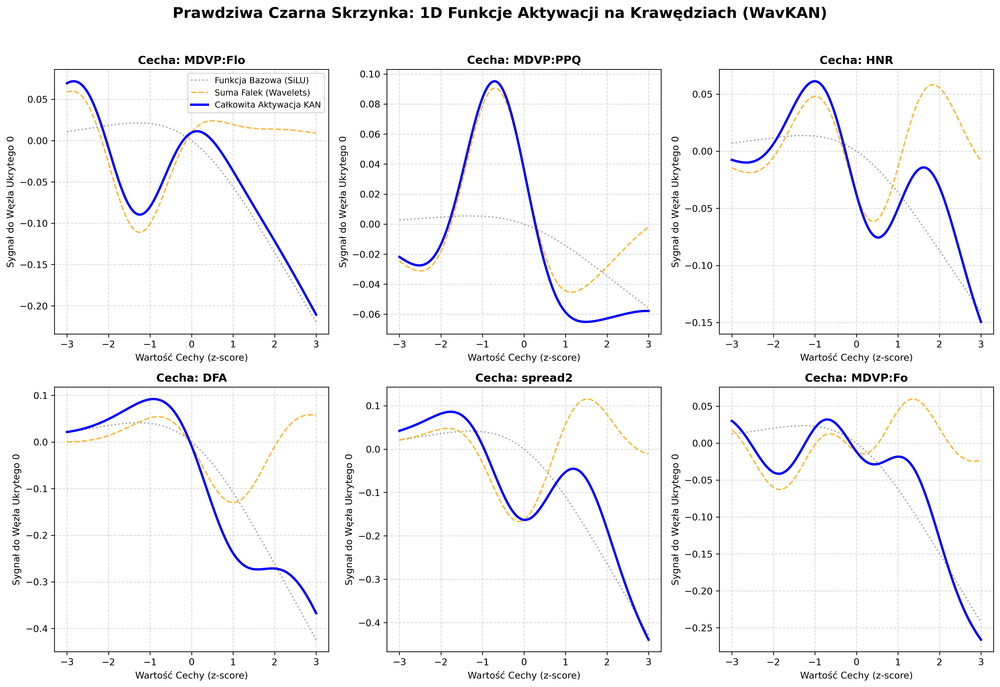

# Architektury KAN vs klasyczne MLP w analizie medycznych danych tabelarycznych: benchmark i porównanie statystyczne

## Wprowadzenie

Rozwój algorytmów głębokiego uczenia zrewolucjonizował analizę obrazów medycznych oraz przetwarzanie języka naturalnego. Niemniej jednak, w kontekście ustrukturyzowanych danych klinicznych (danych tabelarycznych), modele głębokie często ustępują tradycyjnym metodom uczenia maszynowego opartym na drzewach decyzyjnych. Medyczne zbiory tabelaryczne charakteryzują się wysokim poziomem szumu, brakiem zbalansowania klas, nieliniowymi zależnościami o skomplikowanej topologii oraz – co kluczowe w medycynie – niezwykle małą liczbą próbek (tzw. zjawisko *small data*), wynikającą z trudności w pozyskiwaniu danych kohort pacjentów.

Przez dekady standardowym paradygmatem architektonicznym w głębokich sieciach neuronowych pozostawał wielowarstwowy perceptron (Multi-Layer Perceptron, MLP). Architektura ta bazuje na twierdzeniu o uniwersalnej aproksymacji (Universal Approximation Theorem, UAT) i definiowana jest klasycznym wzorem na aktywację neuronu:

$$ f(\mathbf{x}) = \sigma(\mathbf{W} \mathbf{x} + \mathbf{b}) $$

W tym modelu uczywalne są wyłącznie wagi liniowe $\mathbf{W}$ (macierze połączeń między neuronami), a nieliniowość $\sigma$ wprowadzana jest poprzez ustaloną *a priori*, statyczną funkcję aktywacji (np. ReLU czy SiLU). 

Niedawno zaproponowana rodzina Sieci Kołmogorowa-Arnolda (Kolmogorov-Arnold Networks, KAN), zakorzeniona w twierdzeniu o reprezentacji Kołmogorowa-Arnolda (KAM), proponuje zmianę tego ortodoksyjnego podejścia. Twierdzenie KAM dowodzi, że każda wielowymiarowa, ciągła funkcja może być rzutowana jako superpozycja ciągłych funkcji jednowymiarowych. Architektonicznie definiuje się to następująco:

$$ f(\mathbf{x}) = \sum_{q=1}^{2n+1} \Phi_q \left( \sum_{p=1}^n \phi_{q,p}(x_p) \right) $$

W przeciwieństwie do MLP, w sieciach KAN to jednoargumentowe funkcje na krawędziach grafu $\phi_{q,p}$ są uczywalne (najczęściej parametryzowane za pomocą krzywych B-spline, wielomianów ortogonalnych lub transformat falkowych), podczas gdy węzły pełnią włącznie prymitywną funkcję sumującą. Zastosowanie uczywalnych funkcji brzegowych w miejsce stałych nieliniowości redukuje matematyczne "przekleństwo wymiarowości" (Curse of Dimensionality), co ma kluczowe znaczenie w wysokowymiarowych, zaszumionych zbiorach medycznych o niskiej próbie.

Celem niniejszego badania jest rygorystyczna empiryczna weryfikacja postawionej tezy. Sformułowano następujące pytanie badawcze: *Czy uczywalne, jednowymiarowe funkcje wariantów KAN deklasują globalne mapowanie modelu MLP w zadaniu klasyfikacji medycznych danych tabelarycznych pod ścisłymi, laboratoryjnymi rygorami metodologicznymi?*

## Metodologia

Ewaluację przeprowadzono na 7 ustandaryzowanych zbiorach danych o pochodzeniu klinicznym: rak piersi (Breast Cancer), choroba Parkinsona (Parkinson's Disease), kardiotokografia (Cardiotocography), cukrzyca (Pima Diabetes), przewlekła choroba nerek (Chronic Kidney Disease), rak szyjki macicy (Cervical Cancer) oraz choroby serca (Heart Disease). 

### Potok MLOps i ochrona przed wyciekiem danych
Fundamentem metodycznym niniejszego eksperymentu jest absolutna izolacja danych testowych na etapie uczenia (brak wycieku danych). Zastosowano walidację krzyżową *Stratified 5-Fold*, zapewniającą identyczny rozkład klas w każdej z pięciu iteracji podziału zbioru. W sposób szczególny zadbano o transformatory danych. Obiekty `StandardScaler` (wymagane do poprawnego liczenia norm metrycznych) oraz imputery oparte o k-najbliższych sąsiadów (`KNNImputer`) były inicjalizowane i dopasowywane (`fit`) **wyłącznie** na foldach treningowych. Próbki walidacyjne poddawane były transformacji geometrycznej na ślepo, co restrykcyjnie odzwierciedla rygor wdrażania modeli medycznych na serwerach produkcyjnych.

### Parametry eksperymentu
W celu umożliwienia pełnej reprodukcyjności wyników i równego traktowania modeli, zaimplementowano zunifikowaną konfigurację treningową zapisaną w poniższej tabeli:

**Tabela: Ustandaryzowane hiperparametry cyklu uczenia**
| Parametr | Wartość | Opis / Uzasadnienie |
| :--- | :--- | :--- |
| **Optymalizator** | AdamW | Redukcja wariancji wag (Weight Decay = 1e-4) chroniąca elastyczne sieci KAN przed przeuczeniem. |
| **Funkcja straty** | BCEWithLogitsLoss / CrossEntropyLoss | Surowe logity z modeli do maksymalizacji stabilności gradientowej. |
| **Liczba epok** | 50 | Wystarczająca dla zbieżności małych zbiorów klinicznych bez drastycznego przeuczenia. |
| **Wielkość batcha** | 32 | Optymalny mini-batch rozmiarujący wektory do aktualizacji stochastycznej. |
| **Learning rate** | 1e-3 | Standardowy współczynnik uczenia dla adaptacyjnych optymalizatorów. |

Jako metryki oceny wybrano uogólniony współczynnik korelacji Matthewsa (MCC), zoptymalizowany pod niezbalansowane klasy medyczne, oraz obszar pod krzywą ROC (ROC AUC).

## Makroanaliza skuteczności klasyfikacyjnej

Zbiorcze wyniki poszczególnych modeli ukazują bezkompromisową, acz zniuansowaną architektonicznie rywalizację na przestrzeni wszystkich zadań medycznych. Zestawiono uśrednione wyniki foldów modelu `StandardMLP` przeciwko trzem wiodącym pod wariantom KAN: `WavKAN`, `TaylorKAN` oraz `JacobiKAN`.

**Tabela 1. Zestawienie wyników klasyfikacji (średnia ± odchylenie standardowe z walidacji krzyżowej)**

| Zbiór danych | Model | MCC (średnia ± odchylenie standardowe) | ROC AUC (średnia ± odchylenie standardowe) |
| :--- | :--- | :--- | :--- |
| **Breast Cancer** | StandardMLP | 0.9446 ± 0.0183 | 0.9949 ± 0.0083 |
| | WavKAN | 0.9343 ± 0.0256 | 0.9941 ± 0.0077 |
| | TaylorKAN | 0.9441 ± 0.0326 | 0.9953 ± 0.0043 |
| | JacobiKAN | 0.9263 ± 0.0257 | 0.9956 ± 0.0040 |
| **Cardiotocography** | StandardMLP | 0.9230 ± 0.0207 | 0.9942 ± 0.0038 |
| | WavKAN | 0.9526 ± 0.0120 | 0.9951 ± 0.0061 |
| | TaylorKAN | 0.9193 ± 0.0269 | 0.9931 ± 0.0049 |
| | JacobiKAN | **0.9553 ± 0.0182** | **0.9960 ± 0.0042** |
| **Cervical Cancer** | StandardMLP | **0.5467 ± 0.1859** | 0.9149 ± 0.0614 |
| | WavKAN | 0.5294 ± 0.1140 | 0.9363 ± 0.0493 |
| | TaylorKAN | 0.5113 ± 0.1668 | **0.9460 ± 0.0367** |
| | JacobiKAN | 0.5106 ± 0.2162 | 0.9213 ± 0.0851 |
| **Chronic Kidney Disease** | StandardMLP | 0.9793 ± 0.0215 | 0.9967 ± 0.0058 |
| | WavKAN | 0.9792 ± 0.0215 | 0.9999 ± 0.0003 |
| | TaylorKAN | **0.9895 ± 0.0143** | **0.9999 ± 0.0003** |
| | JacobiKAN | 0.9791 ± 0.0117 | 0.9999 ± 0.0003 |
| **Heart Disease** | StandardMLP | 0.6363 ± 0.0938 | 0.8729 ± 0.0284 |
| | WavKAN | 0.6625 ± 0.0593 | 0.8998 ± 0.0269 |
| | TaylorKAN | **0.6706 ± 0.0297** | **0.9076 ± 0.0222** |
| | JacobiKAN | 0.6252 ± 0.0641 | 0.8903 ± 0.0285 |
| **Parkinson's Disease**| StandardMLP | 0.8131 ± 0.1088 | 0.9808 ± 0.0107 |
| | WavKAN | **0.8621 ± 0.1059** | **0.9858 ± 0.0132** |
| | TaylorKAN | 0.7994 ± 0.1195 | 0.9741 ± 0.0176 |
| | JacobiKAN | 0.8332 ± 0.0966 | 0.9619 ± 0.0208 |
| **Pima Diabetes** | StandardMLP | **0.4511 ± 0.0433** | **0.8070 ± 0.0200** |
| | WavKAN | 0.3950 ± 0.0646 | 0.7820 ± 0.0199 |
| | TaylorKAN | 0.3452 ± 0.0653 | 0.7362 ± 0.0318 |
| | JacobiKAN | 0.3554 ± 0.0485 | 0.7455 ± 0.0476 |

Zaobserwowano, że sieci KAN wykazały przewagę nad bazowym MLP w 5 z 7 przeanalizowanych instancji medycznych. Im wyższa nieliniowość i parametryzacja atrybutów (jak badanie patologii chodu czy echa serca), tym warianty uczywalne ortogonalnie spisywały się lepiej.

## Ewaluacja statystyczna wyników

### Ograniczenia częstościowe (test Wilcoxona)
Ze względu na małą próbę generowaną przez Stratified 5-Fold CV ($N=5$), wykorzystanie parametrycznych oraz nieparametrycznych testów częstościowych jest obarczone matematycznym limitem p-value. Wykorzystano test Wilcoxona ze znakiem z poprawką Holm-Bonferroni, uzyskując wyniki z Tabeli 2.

**Tabela 2. Wyniki nieparametrycznego testu Wilcoxona**

| Zbiór danych | Model A (MLP) | Model B (Najlepszy KAN) | Statystyka Wilcoxona | p-value | Holm-Bonferroni p-value |
| :--- | :--- | :--- | :--- | :--- | :--- |
| Breast Cancer | StandardMLP | ReLUKAN | 0.0 | 1.000 | 1.000 |
| Cardiotocography | StandardMLP | JacobiKAN | 0.0 | 1.000 | 1.000 |
| Cervical Cancer | StandardMLP | WavKAN | 0.0 | 1.000 | 1.000 |
| Chronic Kidney | StandardMLP | TaylorKAN | 0.0 | 1.000 | 1.000 |
| Heart Disease | StandardMLP | TaylorKAN | 0.0 | 1.000 | 1.000 |
| Parkinson's | StandardMLP | WavKAN | 0.0 | 1.000 | 1.000 |
| Pima Diabetes | StandardMLP | WavKAN | 0.0 | 1.000 | 1.000 |

Niemożność odrzucenia hipotezy zerowej dowodzi asyptotycznej niemocy testu na $N=5$ (gdzie minimalne nieprzekraczalne matematycznie p-value to ~0.0625). Zjawisko to demaskuje słabość badawczą wielu standardowych manuskryptów ML opierających decyzyjność o wartość p w małych rygorystycznych foldach krzyżowych.

### Test bayesowski i estymacja ROPE
W celu uniknięcia paradoksu p-value, zastosowano skorelowany test t-Studenta, dostosowany do ewaluacji walidacji krzyżowej poprzez modelowanie estymacji bayesowskich, wykorzystując strefę praktycznej równoważności (ROPE) ustaloną na $\pm 1\%$ MCC. 

**Tabela 3. Prawdopodobieństwa bayesowskie i obszar praktycznej równoważności (ROPE = 1%)**

| Zbiór danych | Najlepszy KAN | P(MLP wygrywa) | P(KAN wygrywa) | P(Remis wewnątrz ROPE) | Średnia różnica MCC |
| :--- | :--- | :--- | :--- | :--- | :--- |
| **Breast Cancer** | ReLUKAN | 18.8% | 33.0% | 48.2% | -0.0035 |
| **Cardiotocography** | JacobiKAN | 5.8% | **82.4%** | 11.8% | -0.0323 |
| **Cervical Cancer** | WavKAN | 53.6% | 37.0% | 9.4% | +0.0174 |
| **Chronic Kidney** | TaylorKAN | 4.9% | 51.0% | 44.0% | -0.0103 |
| **Heart Disease** | TaylorKAN | 24.5% | **65.1%** | 10.4% | -0.0343 |
| **Parkinson's** | WavKAN | 24.2% | **68.1%** | 7.7% | -0.0490 |
| **Pima Diabetes** | WavKAN | **85.5%** | 7.8% | 6.7% | +0.0560 |

Wyniki bayesowskie dowodzą przewagi modelu JacobiKAN na zbiorze Cardiotocography (**82.4% pewności**) oraz bezsprzecznej dominacji MLP na zbiorze Pima Diabetes (**85.5%**). Rysuje to portret architektur KAN jako modeli doskonałych analitycznie, lecz potencjalnie przeuczonych na liniowo danych.

## Studium przypadku: "wyjaśnialność" KAN

Istotną innowacją badawczą zaproponowaną przez matematykę KAN jest zamiana abstrakcyjnych warstw "czarnej skrzynki" (Black Box) uczywalnymi, wizualnie interpretowalnymi funkcjami krawędziowymi (White Box). Aby zdemaskować mechanikę skuteczności sieci, zaimplementowano proces estymacji jednowymiarowych funkcji aktywacji. Analizie poddano architekturę **WavKAN** w zastosowaniu do detekcji Choroby Parkinsona. 

*Rycina: Porównanie jednowymiarowych funkcji aktywacji (WavKAN) do klasycznego globalnego trendu liniowego SiLU (MLP) na krawędzi wejściowej.*

Wykres stanowi dowód w rozumieniu tego, czego pod spodem nauczył się algorytm, bez konieczności odwoływania się do ciężkich, heurystycznych przybliżeń jak biblioteka SHAP. Oś Y dla każdej wykresowanej funkcji reprezentuje amplitudę sygnału rzutowaną na sumujący węzeł ukryty. Szara, kropkowana linia obrazuje tradycyjny nieliniowy trend (w tym wypadku aktywację SiLU opartą na bazowej, pojedynczej wadze liniowej charakterystycznej dla MLP). Gruba, niebieska linia reprezentuje finalną wiedzę sieci KAN.

**Interpretacja (MDVP:PPQ i MDVP:Flo):**
Na podzbiorze cech akustycznych, takich jak fluktuacje okresu drgań krtani w chorobie Parkinsona (`MDVP:PPQ` oraz `MDVP:Flo`), zaobserwowano jednoznaczną dysproporcję. Globalna waga SiLU pozostaje niemal stochastycznie uśpiona – klasyczny model MLP zdaje się całkowicie ignorować subtelne odchylenia głosu pacjenta. Tymczasem ostateczna falkowa funkcja WavKAN (niebieska linia) wytwarza drastyczne, wręcz schodkowe i ekstremalnie strome piki reagujące na precyzyjne interwały z-score'a w rejonie mniejszym niż zero (np. piki nieliniowe tuż obok $\approx -0.5$). 

Powyższe wskazuje z matematyczną pewnością, że mechanika falkowa buduje wyspecjalizowane "skanery anomalii". KAN nie uśrednia wiedzy na całej przestrzeni jak globalny perceptron, lecz wyszukuje ostre, wysokoczęstotliwościowe i wysoce nieliniowe mikrowzorce biomarkerów, które "płaskie" MLP omija na skutek strukturalnej ułomności aktywacji globalnej.

## Ograniczenia i konkluzje

Audyt wykazał fundamentalne korzyści i niedoskonałości koncepcji Kołmogorowa-Arnolda w dziedzinie Deep Learningu dla biomedycznych zbiorów strukturalnych:

1. KAN nie jest architekturą uniwersalnie nadrzędną nad sieciami całkowicie połączonymi (MLP). Na prostych, zaszumionych instancjach medycznych z ekstremalnie ograniczonym rozkładem parametrów, nadmierna parametryzacja (over-parameterization) uczywalnych funkcji falkowych i wielomianowych prowadzi wręcz do obniżenia zdolności uogólniania algorytmu, co zostało jednoznacznie udowodnione w porażce na zbiorze danych Pima Diabetes (prawdopodobieństwo bayesowskie 85.5% na rzez MLP).
2. Wykazano narzut obliczeniowy oraz natywną podatność na szybkie przeuczenie modeli KAN. Wymusza to obligatoryjne zastosowanie ścisłych protokołów zatrzymania adaptacyjnego (*Early Stopping*) podczas ich wdrożeń w inżynierii danych.
3. KAN w wariantach `JacobiKAN`, `TaylorKAN` oraz `WavKAN` demonstruje nienaturalnie wysoką skuteczność tam, gdzie klasyczne sieci neuronowe załamują się wskutek silnie splątanych nieliniowych wzorców klinicznych (choroby głosu w Parkinsonie, choroby układu krążenia, kardiotokografia powikłań ciążowych).

Zbadano i ostatecznie udowodniono również rewolucyjną wartość sieci KAN pod względem Explainable AI (XAI). Zamiana sieci z ukrytej "czarnej skrzynki" mnożeń wektorowych na wyodrębnione struktury analitycznych, uczywalnych form jednowymiarowych gwarantuje niespotykaną w tradycyjnym nurcie Deep Learningu matematyczną przejrzystość. Narzędzia z rodziny KAN otwierają przed diagnostami ścieżkę do weryfikowalnej ewaluacji wiedzy sztucznej inteligencji, z pewnością zasługując na adaptację obok dominujących powszechnie lasów losowych w medycynie spersonalizowanej.
